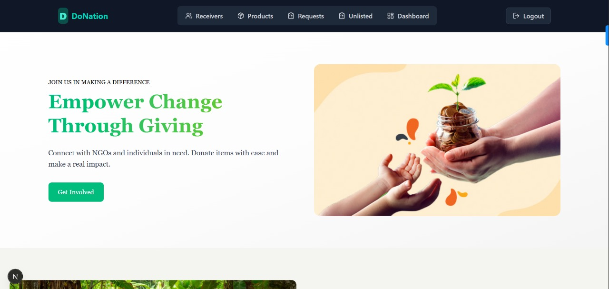
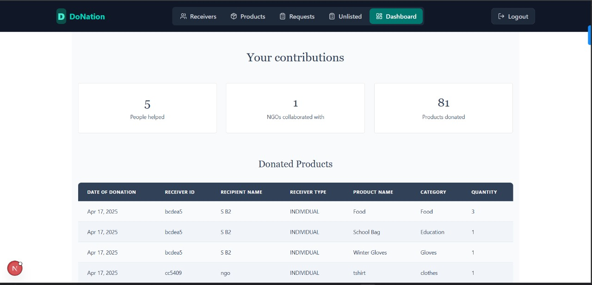

# Donor Portal – Overview

The **Donor Portal** is the interface for individuals who wish to contribute usable items (clothes, shoes, electronics, etc.) to NGOs and recipients.  
It allows donors to **list items for donation**, manage their active and past donations, and respond to specific donation requests from NGOs or recipients.  

The donor experience is designed to be **clean, responsive, and intuitive**, making it easy to browse, list, and track donations.

---

## Key Features

### 1. Authentication & Onboarding
  
- Secure sign-up and login for donors using **JWT authentication**.  
- Responsive form design for desktop and mobile.

---

### 2. Home Dashboard
  
- Welcoming home page highlighting available donation categories.  
- Quick navigation to donation management, unlisted requests, and product listing.

---

### 3. Product Listing & Management
  
- **Products Page:** View all listed donation items.

  
- **Add Product Popup:** A form to create a new donation listing, including category, description, and item images.
- Uses **REST API** to send product data to the backend for storage.

---

### 4. Donation Request Handling
 
- Track custom/unlisted donation requests made by NGOs or recipients.

- Get notified when an NGO accepts your donation request.

- Email notification confirming request acceptance.  
- Manage both **listed donation offers** and **unlisted custom requests** in one place.  
- Real-time updates fetched via API calls.  
- Email notification and in-app alerts when an NGO accepts a donation.

---

### 5. Impact Tracking
  
- Donor dashboard displaying:  
  - Total donations made.
  - NGO collaborations.
  - Recent activity log.

---

## Tech Stack (Donor Side)
- **Frontend:** React (JSX), Tailwind CSS (for responsive layouts)  
- **Backend:** Node.js, Express.js  
- **Database:** PostgreSQL  
- **API Communication:** REST API  
- **Authentication:** JWT  
- **Notifications:** Email alerts and in-app notifications for donation status updates

---

## Responsive Design
All pages and components adapt to mobile, tablet, and desktop using **Tailwind’s responsive classes**, ensuring accessibility for all donors.
