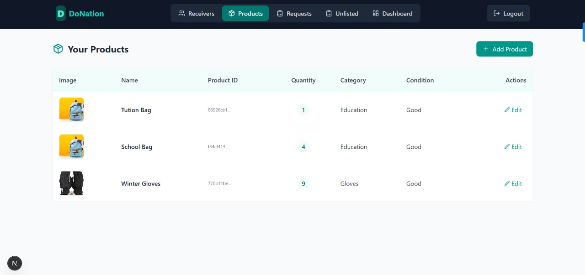

# DoNation
The **Community Donation Platform** is a full-stack web application designed to connect **donors** with **NGOs and individuals in need**. It enables donors to contribute usable items such as clothes, shoes, and electronics, while allowing recipients to request and receive these items through an intuitive, category-based interface. The platform features **two dedicated portals** — one for donors to list and manage their contributions, and another for NGOs/recipients to browse available products, make requests, and track received donations. Built with **React, Node.js, Express, PostgreSQL, and Tailwind CSS**, it offers a secure, responsive, and scalable solution for promoting community-driven support and reducing waste.

## Donor Portal – Overview

The **Donor Portal** is the interface for individuals who wish to contribute usable items (clothes, shoes, electronics, etc.) to NGOs and recipients.  
It allows donors to **list items for donation**, manage their active and past donations, and respond to specific donation requests from NGOs or recipients.  

The donor experience is designed to be **clean, responsive, and intuitive**, making it easy to browse, list, and track donations.

---

### Key Features

#### 1. Authentication & Onboarding
  
- Secure sign-up and login for donors using **JWT authentication**.  
- Responsive form design for desktop and mobile.

---

#### 2. Home Dashboard
  
- Welcoming home page highlighting available donation categories.  
- Quick navigation to donation management, unlisted requests, and product listing.

---

#### 3. Product Listing & Management
  
- **Products Page:** View all listed donation items.

  
- **Add Product Popup:** A form to create a new donation listing, including category, description, and item images.
- Uses **REST API** to send product data to the backend for storage.

---

#### 4. Donation Request Handling
 
- Track custom/unlisted donation requests made by NGOs or recipients.

- Get notified when an NGO accepts your donation request.

- Email notification confirming request acceptance.  
- Manage both **listed donation offers** and **unlisted custom requests** in one place.  
- Real-time updates fetched via API calls.  
- Email notification and in-app alerts when an NGO accepts a donation.

---

#### 5. Impact Tracking
  
- Donor dashboard displaying:  
  - Total donations made.
  - NGO collaborations.
  - Activity log of donations.

---

## Beneficiary Portal – Overview

The **Beneficiary Portal** is the interface for NGOs and individuals seeking essential items from donors.  
It enables beneficiaries to **browse available products**, request donations (both listed and custom), and track the status of their requests in real-time.

The beneficiary experience is designed to be **clear, responsive, and efficient**, making it easy to find, request, and receive much-needed supplies.

---

### Key Features

#### 1. Home & Navigation
  
- Welcoming home page introducing the platform’s mission.  
- Quick access to product categories, pending requests, and dashboard.

---

#### 2. Browsing Categories & Products

- **Categories Page:** Displays all available product categories for browsing.

- **Category Products Page:** Lists all donated items within a selected category, with an option to request specific products.

---

#### 3. Requesting Donations
  
- **Product Request Popup:** Simple form to request a listed item by specifying quantity.

  
- **Custom Request Popup:** Allows beneficiaries to request unlisted items by providing name, condition, quantity, and category.

---

#### 4. Tracking Requests
  
  
- View and track the status of both listed and custom product requests.
- Updates fetched in real-time from the backend.

---

#### 5. Connecting with Donors
  
- Displays a list of registered donors for potential direct communication or follow-up.

---

#### 6. Impact & Insights
  
- Dashboard displaying:  
  - Total donations received.  
  - Most helpful donor.  
  - Donation fulfilled activity.  
- Visual representation of received support.

---

## Tech Stack
- **Frontend:** React (JSX), Tailwind CSS (for responsive layouts)  
- **Backend:** Node.js, Express.js  
- **Database:** PostgreSQL  
- **API Communication:** REST API  
- **Authentication:** JWT  
- **Notifications:** Email alerts and in-app notifications for donation and request status updates

---

## Responsive Design
All pages and components are fully responsive using **Tailwind’s responsive classes**, ensuring a smooth experience for beneficiaries across mobile, tablet, and desktop devices.
